<picture>
  <source media="(prefers-color-scheme: dark)" srcset="./assets/hero-mocha.svg">
  
</picture>

> `OPERATOR NOTE ▸ SYSTEMS ARE DECLARED, NOT DISCOVERED.`

## ▚ EQUIPMENT MANIFEST · PROFESSIONAL

```
RUNTIME       ▸ Node.js
LANGUAGE      ▸ TypeScript · JavaScript
INTERFACE LIB ▸ Lit (Web Components)
SUBSTRATE     ▸ HTML · CSS · Web Platform
```

## ▚ EQUIPMENT MANIFEST · WORKSHOP

```
SUBSTRATE    ▸ Arch Linux
COMPOSITOR   ▸ niri
CONFIG LAYER ▸ home-manager (declarative overlay)
TERMINAL     ▸ kitty
SHELL        ▸ fish
EDITOR       ▸ neovim · zed
FILE MANAGER ▸ yazi
```

▸ Full config manifest → [**github.com/Galimede/dotfiles**](https://github.com/Galimede/dotfiles)

## ▚ TELEMETRY

[](https://github.com/Galimede)
[](https://github.com/Galimede)
[](https://github.com/Galimede)
[](https://github.com/Galimede)

## ▚ TRANSMISSION LOG

<!--START_SECTION:activity-->
1. 🗣 Commented on [#1727](https://github.com/CleverCloud/clever-components/pull/1727#issuecomment-4294839651) in [CleverCloud/clever-components](https://github.com/CleverCloud/clever-components)
2. ❌ Closed PR [#1727](https://github.com/CleverCloud/clever-components/pull/1727) in [CleverCloud/clever-components](https://github.com/CleverCloud/clever-components)
3. 🎉 Merged PR [#1712](https://github.com/CleverCloud/clever-components/pull/1712) in [CleverCloud/clever-components](https://github.com/CleverCloud/clever-components)
4. 🎉 Merged PR [#1715](https://github.com/CleverCloud/clever-components/pull/1715) in [CleverCloud/clever-components](https://github.com/CleverCloud/clever-components)
5. 🔒 Closed issue [#1714](https://github.com/CleverCloud/clever-components/issues/1714) in [CleverCloud/clever-components](https://github.com/CleverCloud/clever-components)
<!--END_SECTION:activity-->

<sub>▸ auto-populated daily by `.github/workflows/transmission-log.yml`</sub>

---

```
┌───────────────────────────────────────────────┐
│  Plain text is the universal interface.       │
└───────────────────────────────────────────────┘
```
